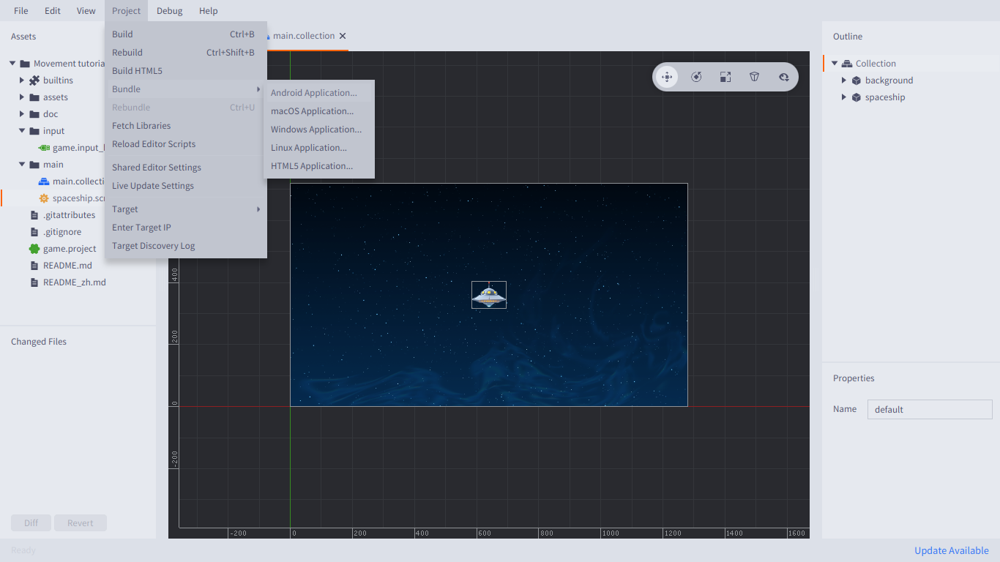
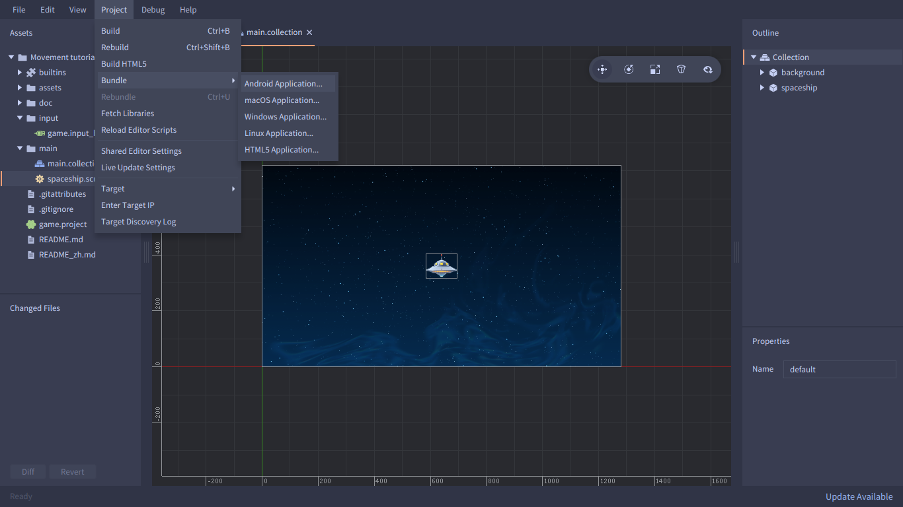
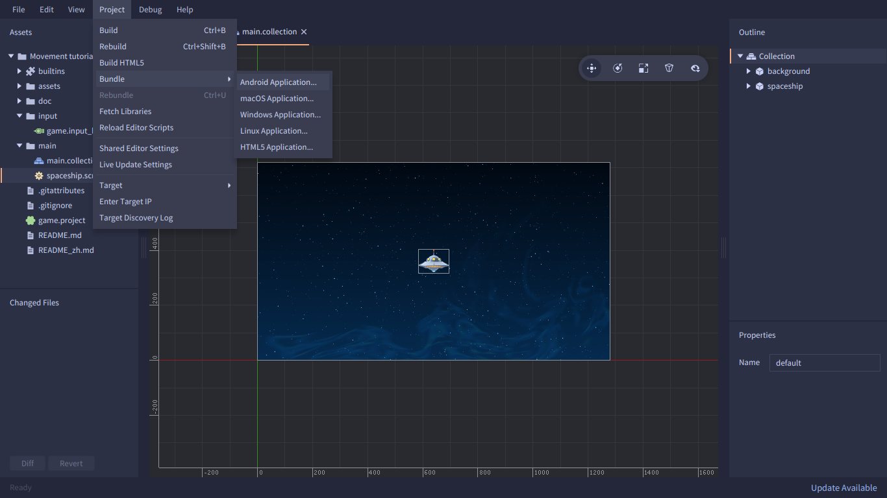
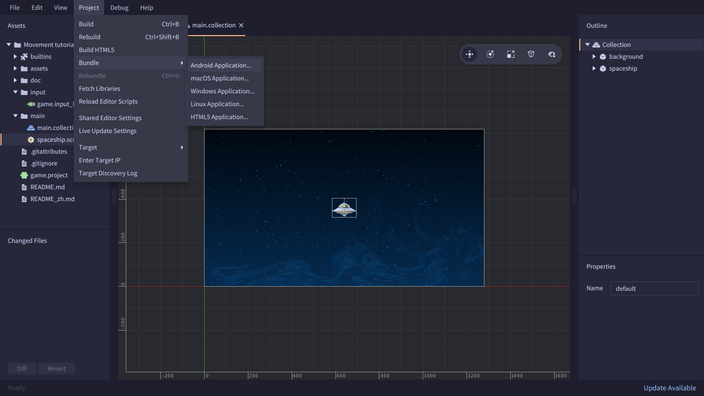

# Defold Catppuccin

  
  
  
  

[Catpuccin](https://github.com/catppuccin) theme for the Defold editor.

## Usage

Create a folder named `.defold` in your user home directory if it isn't already.

- On Windows: `C:\Users\Your Username\.defold`
- On macOS: `/Users/Your Username/.defold`
- On Linux: `~/.defold`

Move the `editor.css` file of your theme of choice there. Then restart the editor or
reload the stylesheet (**Help** → **Reload Stylesheet**).

## License

This theme is licensed under the [MIT license](LICENSE).
